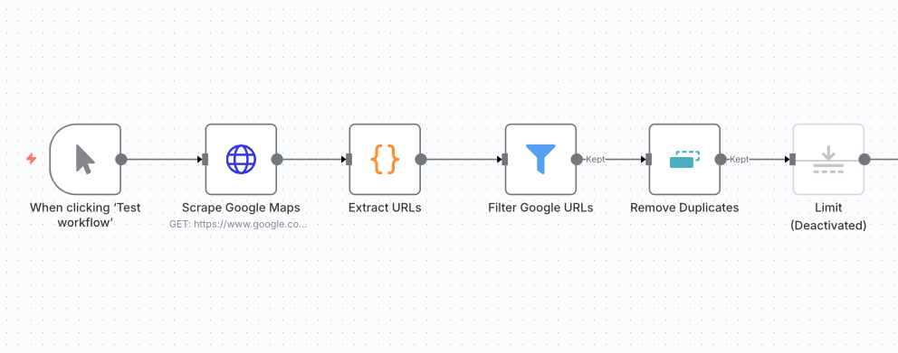
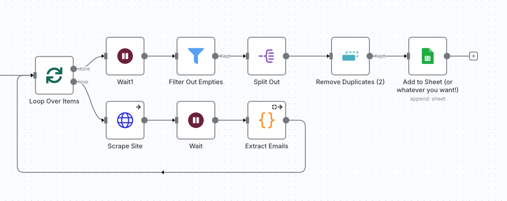

# Marketing Workflows

This folder contains AI-powered workflows for marketing automation, content generation, and lead management. Each workflow includes its dedicated folder with configuration, screenshots, and supporting files.

---

## 📊 AI Marketing Report

Every Monday at 7 a.m. the workflow:

* Pulls last-7-day metrics from **5 Google Analytics properties, Google Ads, and Meta Ads**.
* Compares results with the same week last year.
* Uses GPT-4o to generate concise summaries & comparison tables.
* Sends a clean HTML report via **email and Telegram** to stakeholders.

  
  
  
  

---

## 🎨 Meta Ads Brainstorming with Image Generation

* Upload a competitor ad image.
* Workflow analyzes its **design & psychology** and reads your **brand playbook**.
* Produces a creative brief with “swiped” tactics (without copying).
* Generates **2 Meta-ready ad images** in your colors/logo.

  

---

## 📰 Daily AI Newsletter

* Runs daily at **11 a.m.**
* Queries **Perplexity** for the latest AI news (last 48h).
* Avoids duplicates by checking against a Google Sheet archive.
* Sends a colorful HTML digest with **5 fresh stories**.
* Appends stories to the archive sheet for future de-duplication.

  

---

## ✍️ Blog-post Content Generator

* Input a topic into Google Sheets.
* Workflow researches and writes a **600-word SEO blog post**.
* Designs a **social media infographic**.
* Saves both to Google Drive and links them back into the sheet.

---

## 🗺️ Basic Google Maps Scraper

* Scrapes Google Maps for local businesses (e.g. *“roofing near East London”*).
* Extracts company website URLs.
* Visits each site and harvests **contact emails** using regex.
* Cleans and deduplicates emails.
* Pushes results into a Google Sheet for outreach.

---

## 🧑‍💼 Automated Lead Enrichment & CRM Integration

* A public form collects business emails.
* Hunter verifies validity, Clearbit enriches person + company data.
* Checks Pipedrive to avoid duplicates.
* Creates new leads (contacts + organizations) in one automated flow.

  

---

## 📱 Automate Multi-Platform Social Media Content Creation with AI

* Enter a topic once.
* Workflow researches trends and writes **platform-tailored posts** (LinkedIn, Instagram, Facebook, X, TikTok, Threads, YouTube Shorts).
* Generates matching images.
* Sends HTML preview by email for approval.
* On approval, publishes across platforms and tracks performance.

  

---

## 💥 Viral LinkedIn Post Generator

* Pulls pending topics from Google Sheets.
* Uses **Perplexity & Grok** to gather fresh stats.
* Selects a **viral template** (e.g. “myth-busting”).
* Writes a **1,500-character LinkedIn post** with 5 strong hooks.
* Logs the final post back into Sheets.

  

---
